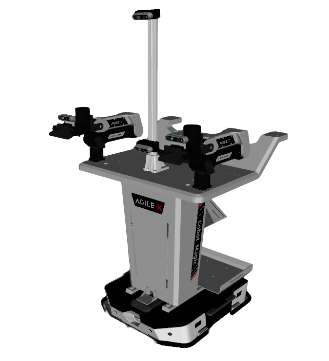
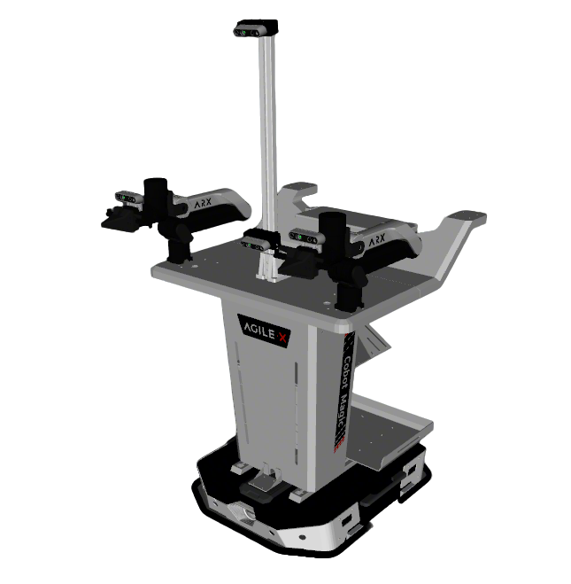

# AgileX Mobile Aloha Description

This package contains the description files for AgileX's Mobile Aloha2 manipulator. The origin models can be found
at [mobile aloha sim](https://github.com/agilexrobotics/mobile_aloha_sim/tree/v2.0.0)

## 1. Build

```bash
cd ~/ros2_ws
colcon build --packages-up-to agilex_aloha_description --symlink-install
```

## 2. Visualize the robot
### 2.1 Full Robot
* Aloha V1
  ```bash
  source ~/ros2_ws/install/setup.bash
  ros2 launch robot_common_launch manipulator.launch.py robot:=agilex_aloha type:=v1
  ```
  
* Aloha V1 with X5 Arm
  ```bash
  source ~/ros2_ws/install/setup.bash
  ros2 launch robot_common_launch manipulator.launch.py robot:=agilex_aloha type:=v1_x5
  ```
  
* Aloha Split
  ```bash
  source ~/ros2_ws/install/setup.bash
  ros2 launch robot_common_launch manipulator.launch.py robot:=agilex_aloha
  ```
  
  

* Aloha V2 (Tracer V1 Base)
  ```bash
  source ~/ros2_ws/install/setup.bash
  ros2 launch robot_common_launch manipulator.launch.py robot:=agilex_aloha type:="v2"
  ```

  
* Aloha V2 (Tracer V2 Base)
```bash
source ~/ros2_ws/install/setup.bash
ros2 launch robot_common_launch manipulator.launch.py robot:=agilex_aloha type:="v2.1"
```

### 2.2 Component
* Ranger Mini
  ```bash
  source ~/ros2_ws/install/setup.bash
  ros2 launch robot_common_launch component.launch.py robot:=agilex_aloha
  ```
* Tracer
  ```bash
  source ~/ros2_ws/install/setup.bash
  ros2 launch robot_common_launch component.launch.py robot:=agilex_aloha type:=tracer
  ```
* Tracer V2
  ```bash
  source ~/ros2_ws/install/setup.bash
  ros2 launch robot_common_launch component.launch.py robot:=agilex_aloha type:=tracer_v2
  ```
  

## 3. OCS2 Demo

### 3.1 Official OCS2 Mobile Manipulator Demo

* Split Aloha
  ```bash
  source ~/ros2_ws/install/setup.bash
  ros2 launch robot_common_launch manipulator_ocs2.launch.py robot_name:=agilex_aloha dual_arm:=true
  ```

### 3.2 OCS2 Arm Controller Demo

* Split Aloha
  ```bash
  source ~/ros2_ws/install/setup.bash
  ros2 launch ocs2_arm_controller demo.launch.py robot:=agilex_aloha
  ```
    ```bash
  source ~/ros2_ws/install/setup.bash
  ros2 launch ocs2_arm_controller demo.launch.py robot:=agilex_aloha hardware:=gz world:=warehouse
  ```